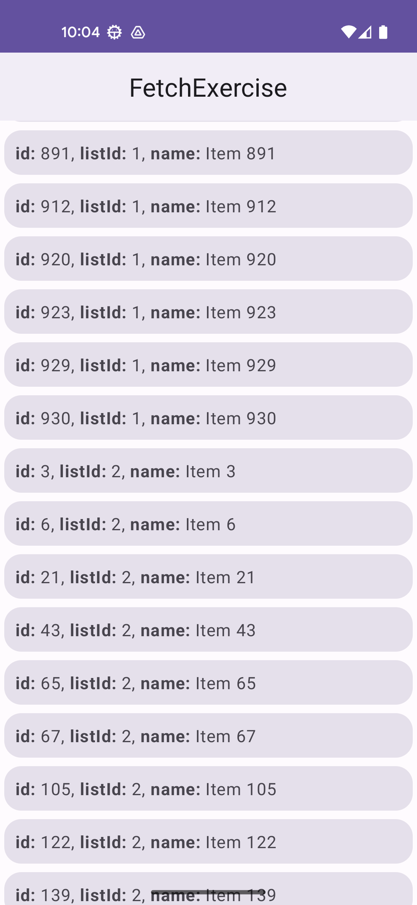

Fetch Android Exercise
==================================

fetch-exercise is an app that displays a scrollable list of items, sorted first by "listId" and then by "name" attribute. 
This data is loaded from a GET request from Web server acting as a REST web service.

Getting Started
---------------

1. Clone this repository using ```git clone git@github.com:bitbytebitco/fetch-exercise.git```
2. Import the sample into Android Studio.
4. Build and run the sample.

Screenshot
---------------


